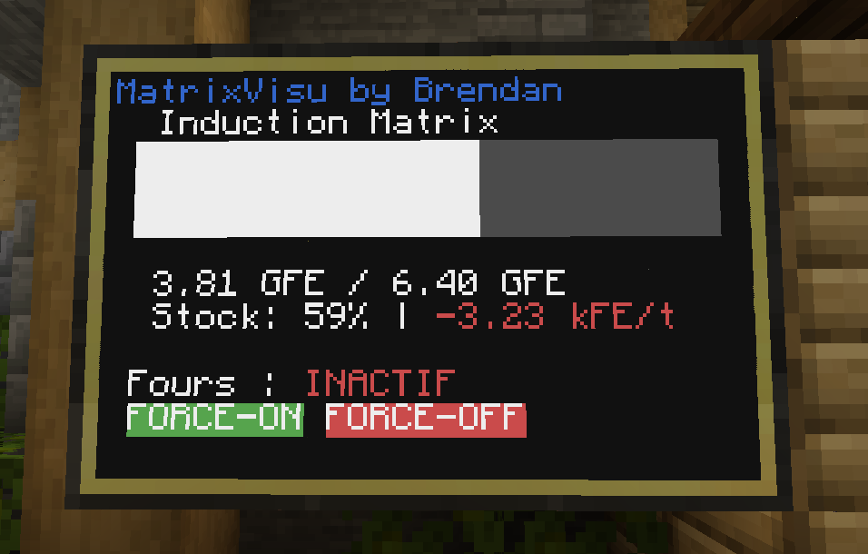
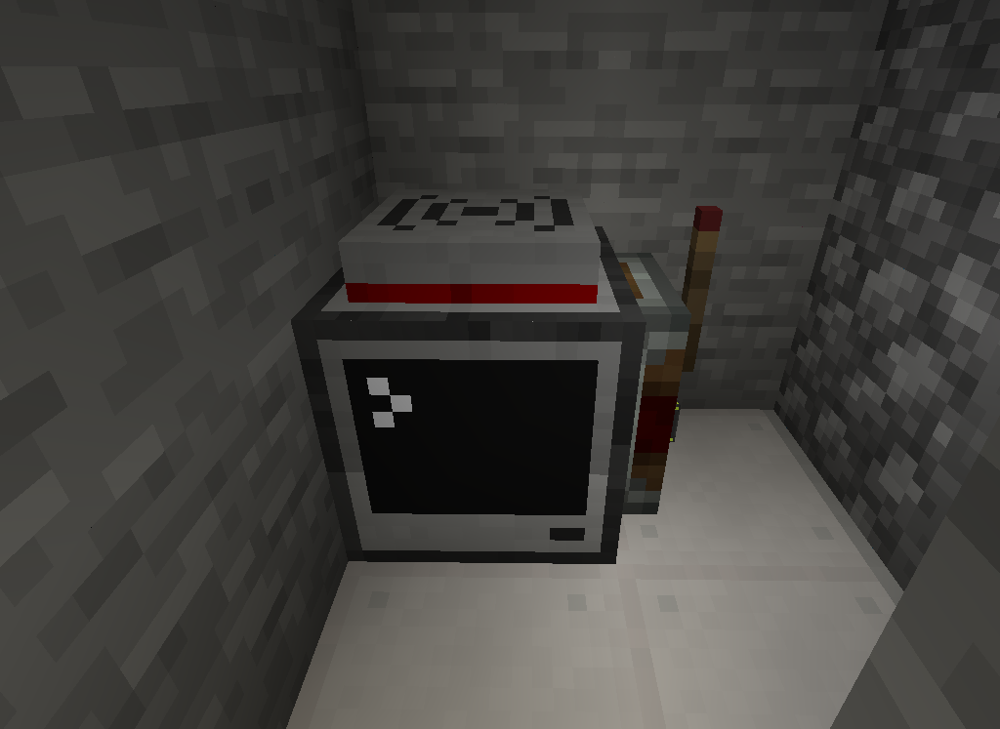

# MatrixVisu & EnergyManager

Permet de faire 2 pc CC:Tweaked.

## MatrixVisu:
  * Ecran d'affichage wireless via Modem
  * Affichage de stockage de l'Induction Matrix
  * Affichage de l'état de marche des générateurs (Des four dans le cas présent)
  * Controle de marche forcé des générateurs (Envoi d'un signal au pc maitre)

---
## EnergyManager:
  * PC Maitre
  * Envoie des données au moniteur via Modem
  * Gestion automatique ou forcée du niveau d'énergie dans l'Induction Matrix
  * Gestion de l'activitée des générateurs via courant de redstone

